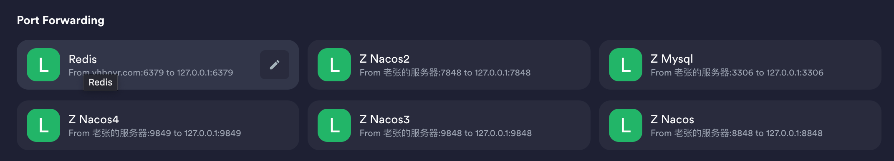
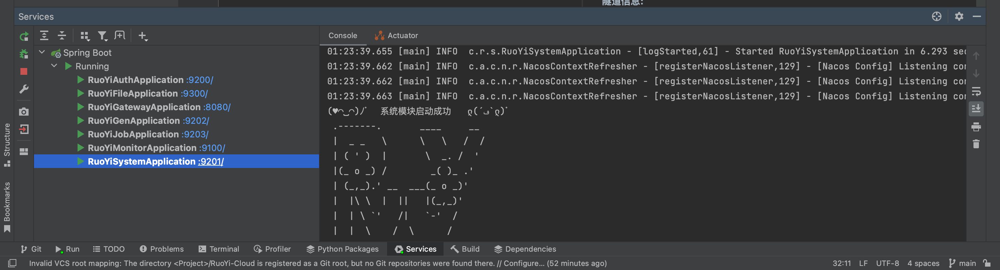
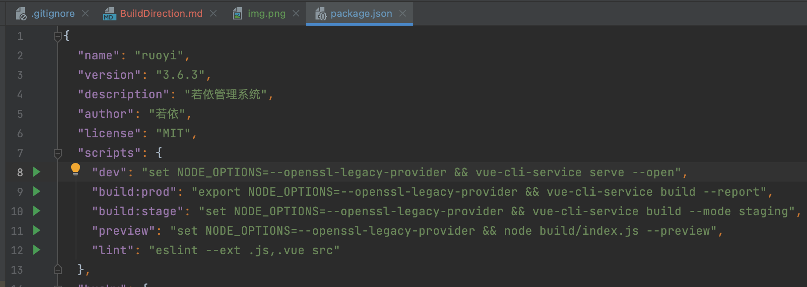

# 项目部署指南


## 一. 将服务通过SSH隧道连接到本地
### 1.安装能打隧道的终端
* Window 建议用Xshell
* Mac 建议用Termius
### 2.打隧道

#### 服务器信息:
| 地址           | 用户名 | 密码        | 负责人 | 服务          |
|--------------|-----|-----------|-----|-------------|
| vhboyr.com   | by  | Zhang2003 | 张泊远 | Redis       |
| 8.130.86.206 | by  | Zhang2003 | 张林宇 | Nacos Mysql |

#### 隧道信息:
| 服务     | 端口                  |
|--------|---------------------|
| Redis  | 6379                |
| Mysql  | 3306                |
| Nacos  | 7848 8848 9848 9849 |
都从本地的127.0.0.1打到对应服务器的127.0.0.1即可,本地和服务器的端口一致.
如图所示:



## 二. 启动后台

### 1. 在intelliJ中克隆并打开项目
#### a.克隆主模块
#### b.拉取子模块
打开主项目目录,在主项目控制台里输入
```commandline
git submodule init
git submodule update
```

### 2. 点击右下角弹框将service添加
### 3. 启动所有服务(无顺序)
如成功将如下图所示:


## 三. 启动前端
### 1. 点开ruoyi-ui/package.json
### 2. 若为Window系统则需将scripts.dev前面的export改成set
如图所示:

### 3. 点击8行号后面的启动按钮运行前端